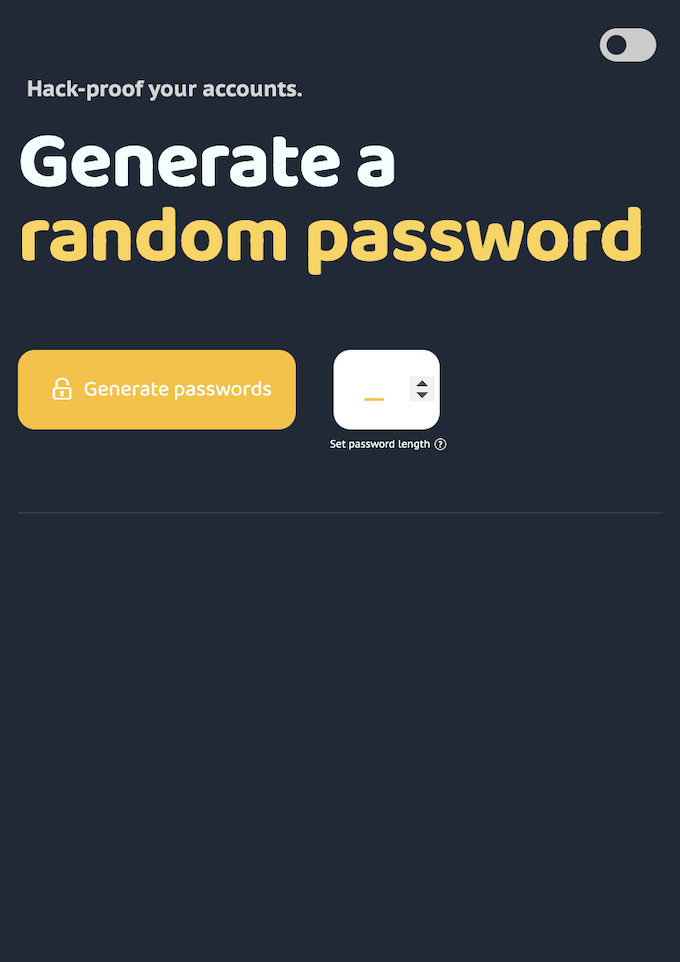

# Password Generator Chrome Extension 🔐🛡️

This Chrome Extension helps users create a secure, randomly generated password in an instant! The project leverages best practices as per the [IBM](https://www.ibm.com/docs/en/baw/20.x?topic=security-characters-that-are-valid-user-ids-passwords) and [NIST](https://rublon.com/blog/nist-password-guidelines/) guidelines on passwords. Using this tool ensures high-security protocols whilst delivering frictionless user interactions.

## Features

- **Password Generation**: Generates passwords ranging from 8 to 20 characters. Users can choose from 4 password options, ensuring comprehensive protection and a password that fits any given criteria. 
- **Light/Dark Mode**: Users can toggle between light and dark themes for better visibility in different environments, or as to their liking. 
- **Copy to Clipboard**: Users can copy the generated password with a single click. Only the first copy action triggers an alert to notify the user, so they're aware of the functionality.
- **Validation Assistance**: Provides help if the password length is outside the acceptable range. If the user hovers over or clicks the help icon, they are provided with the same assistance.
- **Secure Practices**: Logic tailor-made to follow the security guidelines outlined in [IBM's valid characters](https://www.ibm.com/docs/en/baw/20.x?topic=security-characters-that-are-valid-user-ids-passwords) and [NIST's password guidelines](https://rublon.com/blog/nist-password-guidelines/), to ensure high-security, but also to provide a set of universally acceptable passwords.

- ## Functionality and Design

  
  
  
 The image on the left is the light mode interface, and the image on the right is the dark mode interface

## Files Structure

- `index.js`: Contains the logic for generating passwords and handling UI interactions.
- `index.html`: The main HTML file for the Chrome extension.
- `index.css`: Styles for the Chrome extension.
- `index2.css`: Styles for the web variant.

## Installation

To install this extension:
1. Download the repository and unzip it.
2. Open Chrome and navigate to `chrome://extensions/`.
3. Enable Developer Mode, click on "Load unpacked", and select the extension directory.

## Usage

To use the extension:
1. Click the extension icon in Chrome.
2. Set the desired password length within the range of 8 to 20 characters.
3. Click the "Generate" button. The icon will turn from unlocked to locked, indicating that the password is being generated.
4. Click on any generated password to copy it to your clipboard. An alert will confirm the copy action.

## Contributing

Contributions are welcome! Please fork the repo and submit pull requests with the requested changes. Additionally, if you have any feedback on the product, please feel free to reach out and share your thoughts to: sguha@ucsd.edu.

